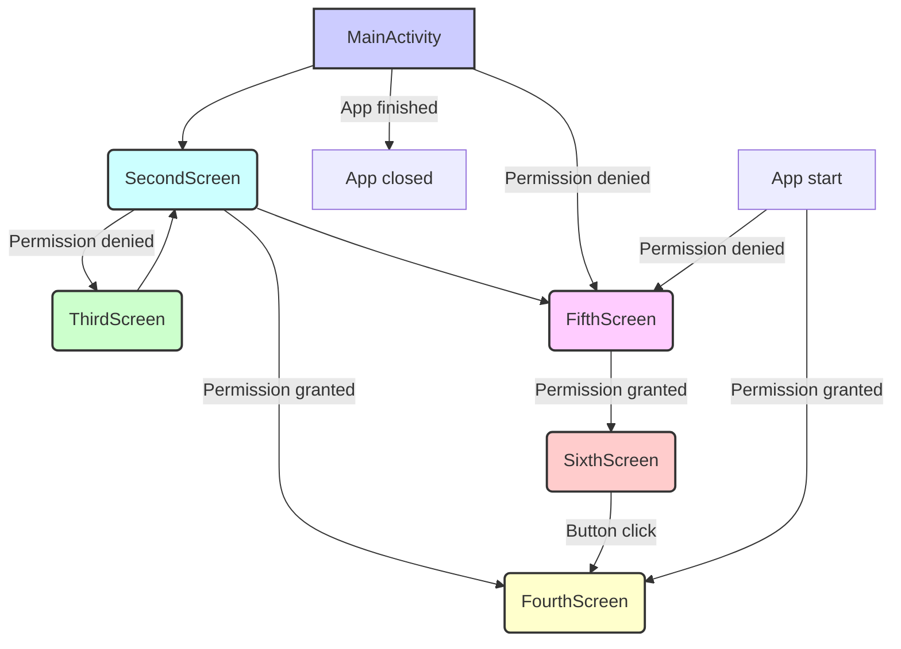

# GetPermissions

このプロジェクトは、Android アプリケーションで位置情報の権限を要求する方法を学ぶためのサンプルアプリです。


## ビルド手順

1.  Android Studio を開きます。
2.  「File」>「Open」から、このプロジェクトのルートディレクトリを選択します。
3.  「Build」>「Make Project」を選択して、プロジェクトをビルドします。

## 実行手順

1.  Android Studio のツールバーにある「Run」ボタン（緑色の再生ボタン）をクリックします。
2.  接続されているデバイスまたはエミュレーターを選択し、アプリを実行します。

## 画面遷移図(Mermaid記法)



```

## ADB コマンド

### 権限の剥奪
```ps
adb shell pm revoke com.example.getpermissions android.permission.ACCESS_FINE_LOCATION
adb shell pm revoke com.example.getpermissions android.permission.ACCESS_COARSE_LOCATION
```

### アプリのアンインストール

```ps
adb uninstall com.example.getpermissions
```

## 依存関係

このプロジェクトは、以下のライブラリを利用しています。

*   Jetpack Compose
*   Navigation Compose

## その他

質問や要望があれば、ご連絡ください。


